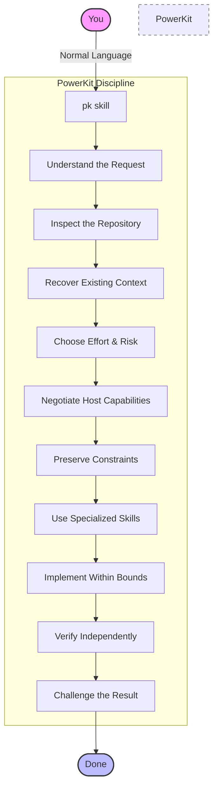
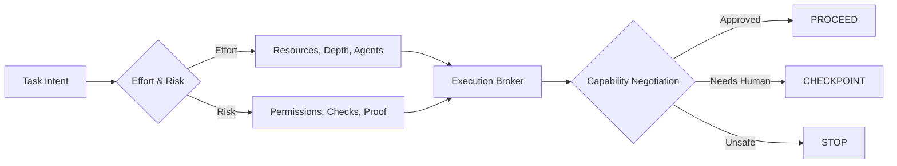

# AI Engineering PowerKit

<div align="center">


<br />

[](https://opensource.org/licenses/MIT)
[](http://makeapullrequest.com)

PowerKit is a portable engineering harness for Codex, Claude Code, and GitHub Copilot.

</div>

---

## How It Works

PowerKit changes the workflow around the model.



When the agent finishes a task, PowerKit shows you what you now own, how it works, and how it was proven. Its Proof Pack starts with a concise Completion Brief, preserves machine evidence locally, and adds an offline visual report when the work is complex enough to benefit from one.

---

## Quick Start

You do not need to learn PowerKit before using it. Just give it to your coding assistant.

**1. Ask your assistant to install:**
```text
Install AI Engineering PowerKit into this repository:

https://github.com/tyreamer/ai-engineering-powerkit

Follow BOOTSTRAP.md, preserve existing project configuration,
verify the installation, and tell me when PowerKit is ready.
```

**2. Invoke PowerKit:**
Once installed, explicitly invoke the `pk` skill and describe the task. Native syntax depends on the host:
- **Codex**: `$pk`
- **Claude Code**: `/pk`
- **GitHub Copilot**: `/pk` (where supported)

---

## Core Principles

### Looks before it asks
Coding assistants often ask questions the repository can already answer. PowerKit pushes the agent to inspect the code, configuration, tests, documentation, decisions, and current state before sending work back to you. Questions are reserved for decisions that actually require a human.

### Separates facts from guesses
Not every missing detail is ambiguity. PowerKit distinguishes between evidence (supported by repository), safe defaults (conventional/reversible), and material assumptions (impacts architecture, security, etc.). Only material assumptions should stop execution.

### Doesn't let the first bug theory win
A plausible explanation is not a root cause. The debugging workflow requires reproduction, competing hypotheses, evidence, falsification, the smallest justified fix, and regression proof.

### Generated code is not finished work
Writing the implementation is one stage. PowerKit independently looks for placeholders, swallowed errors, dead abstractions, missing failure paths, security mistakes, and unsupported completion claims.

### Scales effort, instead of maximizing it
More agents, more reasoning, and more context are not automatically better. PowerKit deliberately keeps easy work cheap and reserves heavyweight workflows for work that deserves them.

---

## The `pk` Command Surface

The `pk` skill routes requests based on actual need. Effort controls resources, Risk controls permissions. 

| Command | Use it when |
|---|---|
| `/pk` or `$pk` | Let PowerKit choose the smallest safe route |
| `pk feature` | Build meaningful functionality |
| `pk bug` | Find the actual cause before fixing |
| `pk review` | Challenge work before merge |
| `pk resume` | Recover the real state of interrupted work |
| `pk architecture` | Design or migrate boundaries safely |
| `pk ui` | Implement or improve UI from evidence |
| `pk dependency` | Evaluate a package, service, model, or vendor |
| `pk deep` | Set a minimum of deep investigation and verification |
| `pk help` | Show the concise command reference |

---

## Architecture & Execution

### Effort × Risk Matrix
PowerKit classifies two independent axes: **Effort** (`FAST` | `STANDARD` | `DEEP`) and **Risk** (`NORMAL` | `ELEVATED` | `HIGH`). 



### Specialized Agents
Parallelize independent investigation. Keep one writer when changes overlap.
| Agent                  | Responsibility                                            |
| ---------------------- | --------------------------------------------------------- |
| `evidence-explorer`    | Understand the real code path without editing it          |
| `system-architect`     | Analyze boundaries, contracts, and migrations             |
| `bounded-implementer`  | Own a clearly defined set of source changes               |
| `independent-verifier` | Prove behavior without trusting the implementation report |
| `adversarial-critic`   | Try to falsify the proposed solution                      |
| `runtime-ui-observer`  | Evaluate the running experience rather than source alone  |

### AI Decides. Code Enforces.
PowerKit uses deterministic tooling for initialization, status checks, effort/risk policy resolution, capability negotiation, static validation, and conflict protection. The model decides what should happen; deterministic tooling handles things that should happen the same way every time.

---

## Engineering for Teams

Progressive disclosure ensures that not every skill belongs in every prompt. PowerKit loads always-on metadata, then routing, then skills, then deeper references only if needed.

A context budget auditor monitors prompt weight. You can use `powerkit context audit --target .` to measure what PowerKit adds to the coding-agent context.

PowerKit is agent-native and syncs across teams. Coding assistants manage it, and teammates can sync project configurations using `powerkit sync` from `.ai-powerkit/project.json` without manually reconstructing agent setups.

It implements safety by design using path-containment checks, symlink defenses, explicit version pins, and dry-runs for mutating lifecycle commands. It is not a security sandbox, but it enforces strict operational constraints.

---

## Repository Map

```text
.agents/skills/     Canonical portable skills, including the pk router
powerkit/           Deterministic lifecycle and CLI implementation
adapters/           Platform-specific agent and hook/config integration
hooks/              Optional deterministic guards
manifests/          Machine-readable PowerKit distribution metadata
evals/              Cross-skill routing fixtures
tests/              Installer, lifecycle, safety, and regression coverage
tools/              Validation, packaging, legacy install, and verification tools
schemas/            Versioned machine contracts, including broker and Proof Pack
docs/               Architecture, security, portability, and operating guidance
BOOTSTRAP.md        Entry point for coding assistants managing PowerKit
```

---

## Project Status & Roadmap

PowerKit is an integration candidate for OpenAI Codex, Anthropic Claude Code, and GitHub Copilot. 

The next goal is a paired Live Client Certification harness: run the same task from the same repository state with vanilla and PowerKit-enabled clients, score observable behavior, preserve safety failures, and report quality separately from token, context, turn, and latency costs. 

See the [Live Client Certification harness](docs/LIVE_CLIENT_CERTIFICATION.md) and [Roadmap](docs/ROADMAP.md) for more details.

---

## Contributing

A useful PowerKit contribution is a repeatable engineering behavior with a clear reason to exist, explicit activation boundaries, known failure cases, deterministic checks, and evidence that it improves outcomes. See [CONTRIBUTING.md](CONTRIBUTING.md) for the contribution model.

## License

MIT
