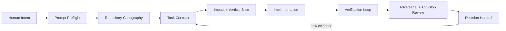

# AI Engineering PowerKit

> **Stop prompting AI coding assistants like chatbots. Start running them like an engineering system.**

AI coding assistants are already powerful. The bottleneck is usually the workflow around them: vague requests, repeated context, premature assumptions, shallow debugging, unverified code, bloated prompts, and sessions that forget what happened five minutes ago.

**AI Engineering PowerKit** is an open, portable operating layer for **Codex, Claude Code, and GitHub Copilot** that turns rough developer intent into disciplined execution.

You stay focused on **what should happen and which decisions actually matter**. The harness pushes the assistant to inspect the repository, recover context, sharpen the task, choose the right level of reasoning, plan the smallest useful slice, implement within bounds, verify the result, attack its own work, and leave behind an evidence-backed handoff.

**23 reusable skills. 6 specialized agent roles. Deterministic guardrails. Cross-assistant adapters. Evals. Installers. One workflow.**

```text
YOU: "This setup has too much friction. Make it feel closer to Plaid."
                         ↓
                 PROMPT PREFLIGHT
                         ↓
               REPOSITORY EVIDENCE
                         ↓
               BOUNDED TASK CONTRACT
                         ↓
              IMPLEMENT THE RIGHT SLICE
                         ↓
            VERIFY → CRITIQUE → HANDOFF
```

The goal is not to make prompts longer. **The goal is to make the AI harder to fool, harder to derail, easier to trust, and dramatically more effective with less human babysitting.**

---

## Why this exists

Most teams are still using frontier coding assistants with a workflow that looks like this:

```text
Prompt → Code → "Looks good" → PR → Find out later what was missed
```

Power users eventually discover a better pattern:

```text
Intent
  ↓
Preflight the request
  ↓
Inspect real repository evidence
  ↓
Separate facts, safe defaults, and material assumptions
  ↓
Choose the lightest effective workflow
  ↓
Plan a vertical slice
  ↓
Implement with one clear writer
  ↓
Prove the behavior
  ↓
Try to break the implementation
  ↓
Leave a trustworthy handoff
```

PowerKit packages that pattern so a whole engineering team can use it instead of every developer inventing their own giant prompt library.

## The operating model



The loop scales down for a tiny change and scales up for migrations, security-sensitive work, architecture changes, APIs, data models, and high-risk delivery.

## What changes for the developer

Instead of spending your time manufacturing perfect prompts, you can increasingly work at the **intent and decision layer**.

You should be able to say:

> “The onboarding is too manual. Let photographers import their existing packages from a screenshot, pasted text, or their site. I want the experience to feel closer to Plaid than a settings form.”

A strong coding assistant should not immediately ask fifteen questions or invent a new architecture. It should inspect the system first, recover what is already known, identify the real implementation boundary, silently sharpen what can be sharpened, surface only material unresolved decisions, and then execute with proof.

That behavior is what PowerKit is designed to make repeatable.

---

# What is inside

## 23 reusable skills

### Foundation

These change how work enters the system:

- **`prompt-preflight`** — turns rough requests into executable understanding without silently inventing important decisions.
- **`engineering-task-orchestrator`** — runs the full evidence-to-delivery loop for complex work.
- **`repository-cartographer`** — maps the real code paths before proposing changes.
- **`task-contract`** — creates a bounded implementation contract from intent + evidence.
- **`context-recovery`** — reconstructs trustworthy state after a new session, compaction, or handoff.
- **`workload-router`** — chooses the lightest effective reasoning, tooling, and agent pattern.
- **`decision-handoff`** — closes work with evidence instead of a vague “done.”

### Delivery

- **`vertical-slice-planner`**
- **`change-impact-analysis`**
- **`implementation-planner`**
- **`parallel-investigator`**
- **`evidence-first-debugging`**
- **`migration-planner`**

### Quality

- **`verification-loop`**
- **`test-gap-hunter`**
- **`adversarial-review`**
- **`anti-slop-review`**
- **`security-privacy-review`**
- **`api-contract-guardian`**
- **`implementation-critic`**

### Specialist

- **`dependency-due-diligence`**
- **`ui-evidence-to-spec`**
- **`runtime-ux-review`**

## 6 specialized agent roles

| Agent | Job |
|---|---|
| `evidence-explorer` | Find the real execution path and return evidence without editing |
| `system-architect` | Evaluate boundaries, contracts, tradeoffs, and migration strategy |
| `bounded-implementer` | Own source changes for a clearly bounded assignment |
| `independent-verifier` | Prove whether the change works without trusting the implementer |
| `adversarial-critic` | Try to falsify the plan or implementation |
| `runtime-ui-observer` | Evaluate the running user experience, not just the source |

**Default rule:** parallelize independent investigation; keep one writer.

## Deterministic tooling

Not everything should be left to model judgment. PowerKit includes scripts and optional hooks for things that should be deterministic:

- installation and profile management
- repository health checks
- static skill validation
- skill scaffolding
- verification command execution
- release packaging
- catastrophic-command protection
- routing eval cases

---

# The three behaviors that matter most

## 1. Inspect before asking

The assistant should search the conversation, repository, decisions, tests, configuration, and nearby patterns before making you repeat information that already exists.

## 2. Distinguish evidence from assumptions

PowerKit explicitly separates:

- **Evidence** — supported by the repository or supplied context.
- **Safe defaults** — reversible, conventional, and unlikely to materially change the result.
- **Material assumptions** — unsupported choices that could change architecture, security, cost, product behavior, contracts, or irreversible work.

Only the third category should normally interrupt the developer.

## 3. Never confuse generated code with completed work

Implementation is not the finish line.

The quality layer looks for:

- fake or placeholder integrations
- swallowed errors
- hardcoded demo behavior
- dead abstractions
- tests that only prove mocks
- unhandled empty/error/permission states
- public contract regressions
- security and privacy mistakes
- TODO paths presented as complete
- broad refactors hidden inside narrow tasks
- completion claims unsupported by runtime evidence

---

# Quick start

### 1. Validate PowerKit

```bash
python3 tools/validate.py
```

### 2. Preview installation into a project

```bash
python3 tools/install.py \
  --target ../your-project \
  --profiles foundation,delivery,quality \
  --platforms codex,claude,copilot \
  --include-agents \
  --dry-run
```

### 3. Install after reviewing the plan

```bash
python3 tools/install.py \
  --target ../your-project \
  --profiles foundation,delivery,quality \
  --platforms codex,claude,copilot \
  --include-agents
```

Or install every profile into your user-level configuration:

```bash
python3 tools/install.py \
  --scope user \
  --profiles all \
  --platforms codex,claude,copilot \
  --include-agents
```

### 4. Check a target repository

```bash
python3 tools/doctor.py --target ../your-project
```

> Requires Python 3.11+.

---

# Recommended team rollout

Do **not** dump every skill onto every developer on day one.

Start with the `foundation` profile on a few real repositories. Measure whether developers spend fewer turns clarifying work, whether agents make fewer material assumptions, whether time-to-valid-implementation improves, and whether “done” work requires less rework.

Then add:

```text
foundation → delivery → quality → specialist
```

The toolkit should earn its complexity through better outcomes.

## Suggested measures

- turns before useful execution begins
- unnecessary clarification questions
- material assumptions made without approval
- time to first valid implementation
- defects discovered after AI claims completion
- human time spent recovering context
- verification depth
- developer override rate
- token/request usage
- rework after handoff

---

# Repository layout

```text
.agents/skills/          Canonical portable Agent Skills
adapters/                Codex, Claude Code, and Copilot agent/config examples
hooks/                   Optional deterministic guard scripts
templates/               Instruction blocks and project configuration
tools/                   Installer, validator, doctor, scaffolder, verification
                               and packaging utilities
evals/                   Cross-skill scenarios and routing guidance
docs/                    Architecture, rollout, security, authoring, measurement
prompts/                 Codex bootstrap/hardening prompts + task launchers
```

The canonical skill source stays vendor-neutral. Platform-specific behavior belongs in adapters rather than contaminating the core skill definitions.

---

# Design principles

1. **Inspect before asking.**
2. **Evidence before assumptions.**
3. **Ask only for material decisions.**
4. **Do not make prompts longer just to make them look sophisticated.**
5. **Use the lightest workflow that protects quality.**
6. **Parallelize independent reading; keep one writer by default.**
7. **Pair implementation with proof.**
8. **Never call partial or unverified work complete.**
9. **Keep canonical skills portable across assistants.**
10. **Use deterministic code for deterministic policy.**
11. **Evaluate the harness itself.**
12. **Continuously turn repeated failures into reviewed improvements to the system.**

---

# Start here

If you only explore five things, make them these:

1. [`prompt-preflight`](.agents/skills/prompt-preflight/SKILL.md) — stop wasting turns on weak request interpretation.
2. [`engineering-task-orchestrator`](.agents/skills/engineering-task-orchestrator/SKILL.md) — see the complete operating loop.
3. [`evidence-first-debugging`](.agents/skills/evidence-first-debugging/SKILL.md) — stop letting the first plausible bug theory win.
4. [`verification-loop`](.agents/skills/verification-loop/SKILL.md) — make “done” mean proven.
5. [`anti-slop-review`](.agents/skills/anti-slop-review/SKILL.md) — catch the code that looks finished because an AI wrote it confidently.

Then read the [Power-user operating playbook](docs/OPERATING_PLAYBOOK.md).

---

# This is not a prompt dump

A prompt library tells a model what to say.

An engineering harness shapes **how work is interpreted, decomposed, executed, verified, challenged, and handed off**.

That is the difference this repository is trying to capture.

PowerKit is intentionally opinionated about workflow while remaining portable across coding assistants. It is a **v0.1.0 starting point**, not a claim that every adapter has been proven in every enterprise environment. Platform behavior evolves quickly; review platform-specific configuration against the versions your team actually runs.

## Contributing

The best contributions are not “here is another clever prompt.” They are repeatable engineering behaviors with clear activation boundaries, failure cases, and evidence that they improve outcomes.

See [`CONTRIBUTING.md`](CONTRIBUTING.md) and [`docs/AUTHORING_SKILLS.md`](docs/AUTHORING_SKILLS.md).

## License

MIT. Review your organization’s internal policies before adopting community or external skill packs.
