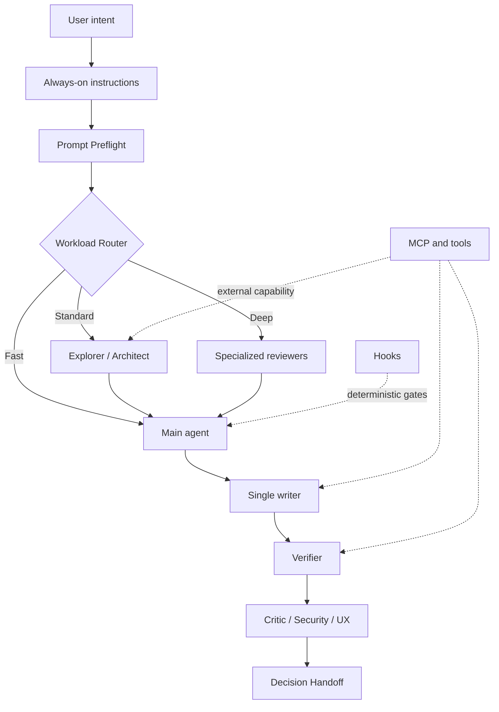

# Architecture

PowerKit separates AI-assistant customization into five layers because each layer solves a different problem.

## 1. Always-on instructions

Use for short, universal working agreements:

- Inspect before asking.
- Preserve scope.
- Ask before material or destructive decisions.
- Run the appropriate verification.
- Report evidence honestly.

Instructions are loaded frequently, so they must stay small. A repeated multi-step procedure belongs in a skill instead.

## 2. Skills

Use for judgment-heavy, reusable workflows such as prompt preflight, repository mapping, debugging, migration planning, and anti-slop review.

Skills are progressively loaded: a host can first use the skill name and description, then load the body only when it applies. The canonical source is `.agents/skills`.

## 3. Subagents

Use for context isolation and specialized roles.

PowerKit's default pattern is:

- Main agent: owns intent, decisions, synthesis, and final response.
- Explorer: gathers repository evidence.
- Architect: evaluates system shape and plans.
- Implementer: single writer for bounded code changes.
- Verifier: runs proof independently.
- Critic: tries to falsify correctness.
- UI observer: reproduces and evaluates runtime UI behavior.

Subagents are most useful for noisy, independent, read-heavy work. Parallel writers are disabled by convention unless file ownership is truly independent.

## 4. Hooks and scripts

Use for deterministic behavior that should not depend on model memory:

- Blocking catastrophic commands.
- Formatting after edits.
- Verifying generated metadata.
- Running repository-defined checks.
- Recording lifecycle events.

Hooks are executable code. They are included as examples and are not automatically enabled by the installer.

## 5. Tools and MCP

Use when the assistant needs authenticated access to external systems, authoritative documentation, databases, issue trackers, design tools, browsers, or deployment platforms.

A skill defines *how to work*. A tool provides *what the agent can do*. Do not encode credentials or business authorization in skills.

## Execution architecture

## Canonical source and adapters

`.agents/skills` is the source of truth. Platform-specific copies are generated or installed, not edited independently.

- Codex and supported Copilot surfaces can use `.agents/skills`.
- Claude Code receives a copy under `.claude/skills`.
- Subagent formats remain platform-specific and live under `adapters/`.
- Hook examples remain platform-specific because lifecycle schemas and trust behavior differ.

## Why profiles exist

Installing every skill everywhere can reduce routing clarity and crowd the skill catalog. Profiles let teams start small:

- `foundation`: behavior and context discipline.
- `delivery`: planning and implementation workflows.
- `quality`: verification and review.
- `specialist`: UI and dependency workflows.

The installer records exactly what it added.
