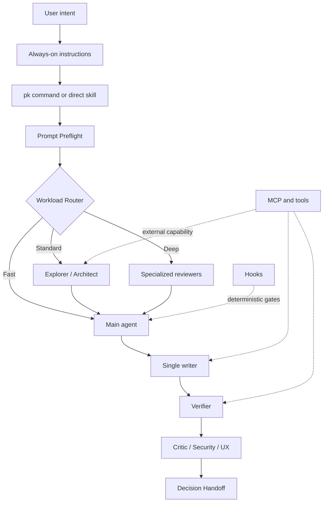

# Architecture

PowerKit separates agent bootstrap from runtime customization. `BOOTSTRAP.md` plus `manifests/powerkit.json` form a small installation control plane; deterministic Python tooling turns that contract into versioned consumer state. Normal coding requests then use six progressively disclosed runtime layers.

## Agent bootstrap control plane

```text
GitHub URL → BOOTSTRAP.md → distribution manifest → pinned tooling
           → project.json desired state → install-manifest.json observed state
           → doctor → /pk
```

The CLI, `python -m powerkit`, and legacy `tools/install.py` all call one installer engine. Models orchestrate that engine; they never generate installed skill copies themselves.

Each runtime layer solves a different problem.

## 1. Command layer

The `pk` skill is the small public interface over the rest of PowerKit. It accepts normal language, preserves explicit constraints, selects a primary task intent and workload depth, then loads only the workflows justified by that request.

The command is intentionally thin:

```text
small skill metadata
        ↓
pk dispatcher
        ↓
on-demand routing reference
        ↓
selected existing skills
        ↓
deeper references, tools, or agents only when needed
```

Shared behavior lives in `.agents/skills/pk`. Its machine-readable command manifest defines the logical modes and native platform mappings. The Copilot prompt adapter delegates to that canonical skill rather than copying its workflow text.

The command layer does not replace direct skill or agent invocation. It makes those mechanisms unnecessary for normal use while keeping them available to advanced users.

### Context budget

- Every request: the host sees normal always-on instructions plus compact skill names and descriptions according to its own discovery rules.
- A `pk` request: the host loads the roughly 100-line command skill and, except for help, its focused routing reference.
- After routing: only the selected workflow skill bodies are loaded.
- Deep references, scripts, agents, and external tools load only when the selected workflow requires them.

`powerkit context audit` makes this model testable. It builds a vendor-neutral inventory from canonical release metadata or installed managed state, then applies a platform loading model for Codex, Claude, or Copilot. Static estimates, future observed traces, primary-agent paths, and isolated agent prompts remain separate. The auditor is CLI code rather than another always-loaded skill, so ordinary tasks pay no new runtime context.

The detailed `pk` mode recipes live in a second reference that is loaded after intent/depth selection. Automatic FAST routing reads only the compact routing reference.

`pk help` stops at the command skill. A fast local change does not load architecture, migration, security, dependency, UI, or adversarial bodies merely because they are installed.

## 2. Always-on instructions

Use for short, universal working agreements:

- Inspect before asking.
- Preserve scope.
- Ask before material or destructive decisions.
- Run the appropriate verification.
- Report evidence honestly.

Instructions are loaded frequently, so they must stay small. A repeated multi-step procedure belongs in a skill instead.

## 3. Skills

Use for judgment-heavy, reusable workflows such as prompt preflight, repository mapping, debugging, migration planning, and anti-slop review.

Skills are progressively loaded: a host can first use the skill name and description, then load the body only when it applies. The canonical source is `.agents/skills`.

## 4. Subagents

Use for context isolation and specialized roles.

PowerKit's default pattern is:

- Main agent: owns intent, decisions, synthesis, and final response.
- Explorer: gathers repository evidence.
- Architect: evaluates system shape and plans.
- Implementer: single writer for bounded code changes.
- Verifier: runs proof independently.
- Critic: tries to falsify correctness.
- UI observer: reproduces and evaluates runtime UI behavior.

Subagents are most useful for noisy, independent, read-heavy work. Parallel writers are disabled by convention unless file ownership is truly independent.

## 5. Hooks and scripts

Use for deterministic behavior that should not depend on model memory:

- Blocking catastrophic commands.
- Formatting after edits.
- Verifying generated metadata.
- Running repository-defined checks.
- Recording lifecycle events.

Hooks are executable code. They are included as examples and are not automatically enabled by the installer.

## 6. Tools and MCP

Use when the assistant needs authenticated access to external systems, authoritative documentation, databases, issue trackers, design tools, browsers, or deployment platforms.

A skill defines *how to work*. A tool provides *what the agent can do*. Do not encode credentials or business authorization in skills.

## Execution architecture



## Canonical source and adapters

`.agents/skills` is the source of truth. Platform-specific copies are generated or installed, not edited independently.

- Codex and supported Copilot surfaces can use `.agents/skills`.
- Claude Code receives a copy under `.claude/skills`.
- Codex invokes the command skill as `$pk`; repository skills are not literal custom slash commands.
- Claude Code exposes the copied skill as `/pk`.
- Supported Copilot IDEs receive a thin `.github/prompts/pk.prompt.md` adapter for `/pk`; skill-capable surfaces can still route through `.agents/skills/pk`.
- Subagent formats remain platform-specific and live under `adapters/`.
- Hook examples remain platform-specific because lifecycle schemas and trust behavior differ.

## Why profiles exist

Installing every skill everywhere can reduce routing clarity and crowd the skill catalog. Profiles let teams start small:

- `foundation`: behavior and context discipline.
- `delivery`: planning and implementation workflows.
- `quality`: verification and review.
- `specialist`: UI and dependency workflows.

The installer records exactly what it added.

The `pk` foundation skill is the explicit daily command router. Its metadata is small, implicit OpenAI invocation is disabled, and its body loads only when `/pk`, `$pk`, or an equivalent explicit request is used.
